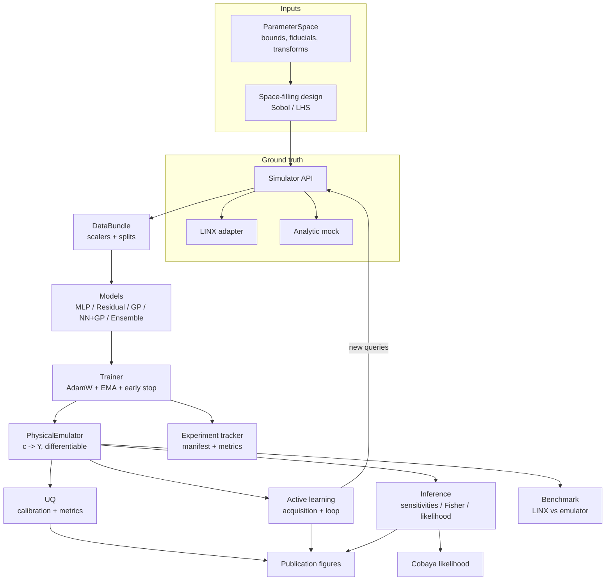
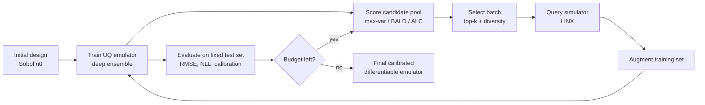

# Architecture

BBN-JAX is organized as a layered, JAX-native pipeline. Every layer is a small,
testable module with a narrow interface; data flows from the simulator through
training to differentiable inference.

## System overview

## The active-learning loop (core contribution)

## Module map

| Module | Responsibility | Key types / functions |
|---|---|---|
| `parameters` | parameter space, priors, transforms | `ParameterSpace` |
| `sampling` | space-filling designs | `sobol_design`, `latin_hypercube` |
| `simulator` | ground-truth BBN | `BBNSimulator`, `LinxSimulator`, `MockBBNSimulator` |
| `data` | generation, containers, scaling | `DataBundle`, `Standardizer`, `TargetTransform` |
| `models` | emulators | `MLPEmulator`, `ResidualEmulator`, `GPModel`, `NNGPEmulator`, `DeepEnsemble`, `PhysicalEmulator` |
| `training` | optimization | `train_model`, `train_ensemble`, `build_optimizer` |
| `uq` | calibration + metrics | `VarianceCalibrator`, `metrics.*` |
| `active_learning` | acquisition + loop | `run_active_learning`, `acquisition.*` |
| `inference` | differentiable science | `abundance_jacobian`, `fisher_matrix`, `BBNLikelihood` |
| `tracking` | provenance + persistence | `ExperimentTracker`, `save/load_emulator` |
| `viz` | figures | `plots.*` |

## Design principles

1. **Standardized vs physical space.** Cores operate in standardized model space
   (zero-mean/unit-variance inputs; `log10` + standardized targets). The
   `PhysicalEmulator` wrapper composes the scalers so science code differentiates
   directly in physical units (`c -> Y`).
2. **Everything differentiable.** Models are Equinox `Module`s (PyTrees); the
   simulator mock and the full emulator support `jax.grad`/`jacfwd`. This makes
   sensitivities, Fisher matrices and HMC scores exact and cheap.
3. **UQ is first-class.** Predictive variance is produced natively (GP / ensemble),
   calibrated on held-out data, and *reused* by active learning — not bolted on.
4. **Runs without LINX.** A physics-motivated analytic mock keeps the whole
   pipeline, including CI, fully exercisable; the LINX adapter swaps in for science.
5. **Reproducibility by construction.** Config-driven runs, explicit PRNG streams,
   float64, and per-run manifests (git SHA, versions, seed).
